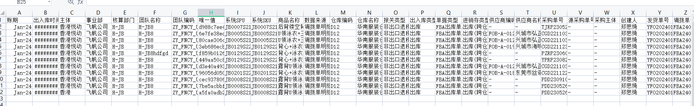
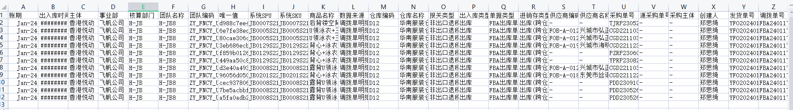
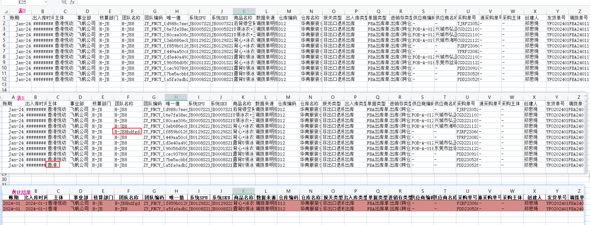

## datacheck

@author: 半只程序员
@version: 0.0.1
@date: 2024-08-15

## 简介

datacheck 是一个用于数据校验的 Python 库。
支持按行，按列比较，支持多种文件格式，如 CSV、Excel 等，支持文件编码和头部行数设置， 支持多种数据类型和校验规则，
可以方便地进行数据校验； 支持日志记录，支持命令行调用，支持 GUI 调用，支持 Web 调用，支持 RESTful API 调用。

## 功能

- 比较两个文件是否相同
- 按行比较
- 按列比较
- 比较两个文件是否相同，并输出不同行
- 比较两个文件是否相同，并输出相同行
- 支持多种数据类型和校验规则
- 支持用户输入字段校验
- 支持多种文件格式，如 CSV、Excel 等
- 支持文件编码和头部行数设置
- 支持日志记录
- 数据去重
- 支持命令行调用
- 支持 GUI 调用
- 支持 Web 调用
- 支持 RESTful API 调用

## 安装

```bash
pip install datacheck
```

## 使用示例

* 按行比较两个文件是否相同

```python

from datacheck.compare_row_plus import CompareRowPlus

value1 = ['id', 'name', 'age']
value2 = ['id', 'name', 'age']
compare = CompareRowPlus('af1c9b53652bef321057dc5e8c89d77f.csv',
                         'af1c9b53652bef321057dc5e8c89d77f备份.csv',
                         flag=1,
                         fields1=value1,
                         fields2=value2,
                         encoding='utf-16',
                         header=0,
                         directory="compare_result",
                         save_path='./compare_result/result.xlsx'
                         )
compare.run()
```

* 参数说明

| 参数名       | 类型   | 默认值                | 说明                                        |
|-----------|------|--------------------|-------------------------------------------|
| file1     | str  | None               | 第一个文件路径                                   |
| file2     | str  | None               | 第二个文件路径                                   |
| flag      | int  | 0                  | 0: 比较两个文件是否相同，并输出相同行，1: 比较两个文件是否相同，并输出不同行 |
| fields1   | list | None               | 第一个文件的字段列表，默认对比所有字段                       |
| fields2   | list | None               | 第二个文件的字段列表，默认对比所有字段                       |
| encoding  | str  | 'utf-8'            | 文件编码                                      |
| header    | int  | 0                  | 文件头部行数                                    |
| directory | str  | result             | 对比结果输出目录                                  |
| save_path | str  | result/result.xlsx | 对比结果输出文件                                  |

    注意：directory 和 save_path 必须同时存在，否则会报错:
    使用示例：
    如果 directory="compare_result" 和 save_path="./compare_result/result.xlsx" 都存在，则对比结果会保存在 compare_result/result.xlsx 文件中。
    如果 directory和 save_path 都不存在，则对比结果会默认保存在当前目录下的 result/result.xlsx 文件中。

* 文件去重deduplicate

```python
from datacheck.deduplicate import deduplicate

deduplicate(data='af1c9b53652bef321057dc5e8c89d77f.csv',
            column_name=['id', 'name', 'age']
            )

```

* 参数说明

| 参数名         | 类型   | 默认值 | 说明      |
|-------------|------|-----|---------|
| data        | str  | 无   | 文件路径    |
| column_name | list | 无   | 需要去重的字段 |

* 列对比，相同值标为红色并输入到Excel文件 compare_two_column

```python
from datacheck.compare_column import compare_two_column

compare_two_column(data='af1c9b53652bef321057dc5e8c89d77f.csv',
                   column1='id',
                   column2='name',
                   output='compare_result')


```

* 参数说明

| 参数名     | 类型  | 默认值 | 说明       |
|---------|-----|-----|----------|
| data    | str | 无   | 文件路径     |
| column1 | str | 无   | 第一个字段    |
| column2 | str | 无   | 第二个字段    |
| output  | str | 无   | 输出对比结果文件 |

## 项目结构

```
datacheck
    ├── result   # 对比结果输出目录
    ├── files     # 对比文件目录
    ├── __init__.py  # 初始化文件
    ├── README.md     # 项目说明文件
    ├── requirements.txt     # 项目依赖文件
    ├── deduplicate.py        # 文件去重
    ├── compare_column.py        # 列对比
    ├── compare_field.py        # 字段对比
    ├── compare_numeral_field.py     # 数值字段对比
    ├── compare_row.py            # 行对比
    ├── compare_row_plus.py         # 行对比 支持自定义字段，全部字段对比
    ├── logger.py                # 日志记录
    ├── read_table.py        # 读取文件（csv,Excel）
    ├── timer.py                # 计时器
    ├── setup.py             # 安装文件
    
      
```
## 对比结果图
* df1

* df2

* 对比结果



## 贡献

欢迎提交 issue 和 PR，一起完善 datacheck 库。

## 许可证

datacheck 是一个开源项目，使用 MIT 许可证。


